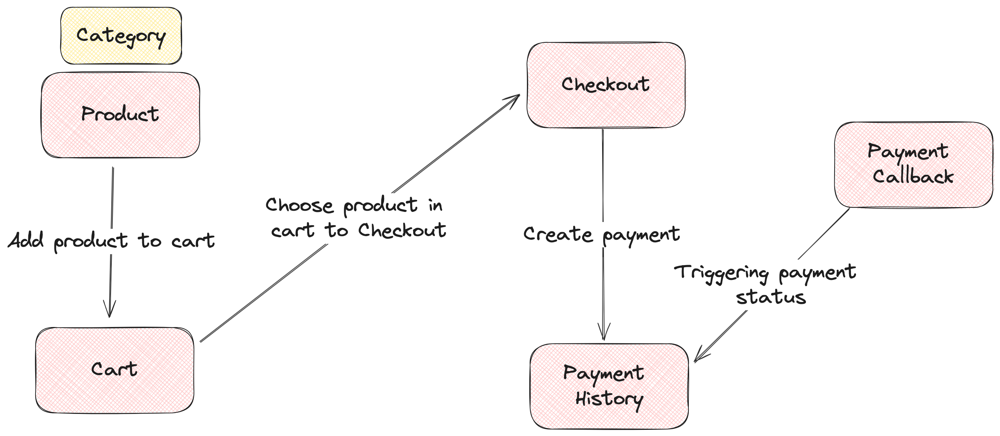

# E-Commerce Platform - Purchase System

This repository contains the core components of the purchase system for our e-commerce platform. The purchase system is designed using a Model-View-Presenter (MVP) architecture and is divided into five main components.

## Components

### 1. Product
The **Product** component provides an overview of the available products. Each product is defined by:
- **Product Overview**: A detailed description of the product.
- **Price**: The cost of the product.
- **Stock**: The current stock level of the product.

### 2. Cart
The **Cart** component stores items that a user has chosen to purchase. It allows users to:
- Add items to the cart.
- Remove items from the cart.
- Update item quantities in the cart.
- Delete item from the cart
- View the current contents of the cart.

### 3. Checkout
The **Checkout** component handles the payment session and collects additional data necessary for processing the purchase. It includes:
- **Payment Method**: The chosen method of payment (only support VA Number Dummy).
- **Total Current Price**: The total price of all items in the cart, including any applicable taxes and shipping costs.

### 4. Payment History
The **Payment History** component records all submitted checkouts for a user. Each entry in the payment history includes:
- **Order Status**: The current status of the order, which can be:
    - **Waiting**: Awaiting payment.
    - **Paid**: Payment has been received.
    - **Expired**: Payment was not completed in the allowed time frame.
    - **Canceled**: The order was canceled by the user or the system.

### 5. Third Party Payment
The **Third Party Payment** component interfaces with external payment providers to process payments. It triggers status updates in the payment history:
- Upon successful payment, the order status is updated to **Paid**.

## Getting Started

To get started with the development or deployment of this purchase system, follow these steps:

### Development
1. **Clone the repository**:
    ```bash
    git clone https://github.com/muhadif/golang-crud-2024
    cd golang-crud-2024
    ```

2. **Install dependencies**:
    ```bash
    go get -v
    ```

3. **Run the migration **:
    ```bash
    make migrate-up
    ```
   
3. **Run the application**:
    ```bash
    make run
    ```

### Deployment
1. **Run Docker Compose**:
    ```bash
    docker compose up -d
    ```

## Usage

### Adding Products
To add a new product, define its overview, price, and stock level in the product component.

### Managing the Cart
Users can add, remove, or update items in their cart. The cart component ensures that all selected items are stored and displayed correctly.

### Processing Checkout
During checkout, users need to select a payment method and confirm their purchase. The checkout component will handle the session and prepare the data for payment processing.

### Viewing Payment History
Users can view their payment history to check the status of their orders. This component maintains a comprehensive record of all transactions.

### Handling Payments
The third-party payment component is responsible for processing payments through external providers and updating the payment history based on the transaction outcome.

## Contributing

We welcome contributions to improve our purchase system. Please fork the repository and submit pull requests.

## License

This project is licensed under the MIT License.